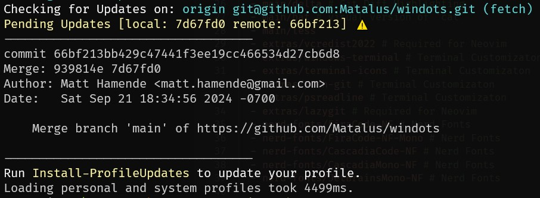
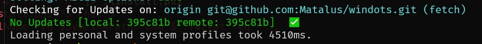
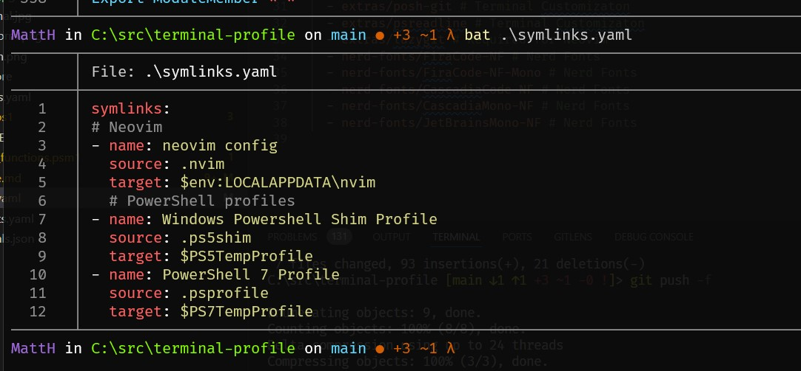
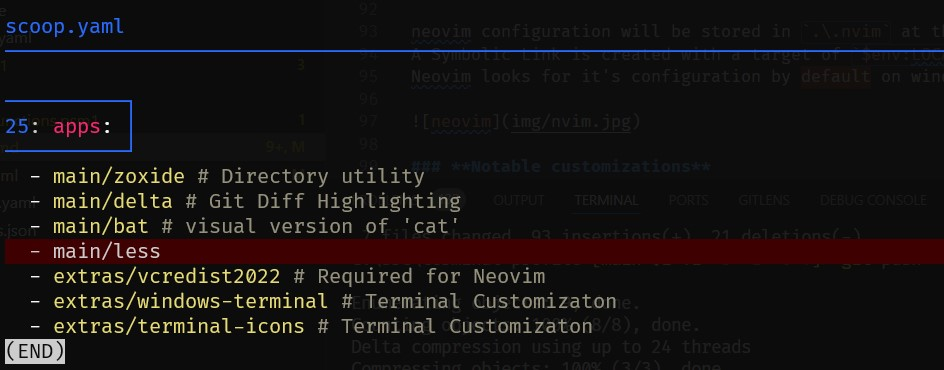
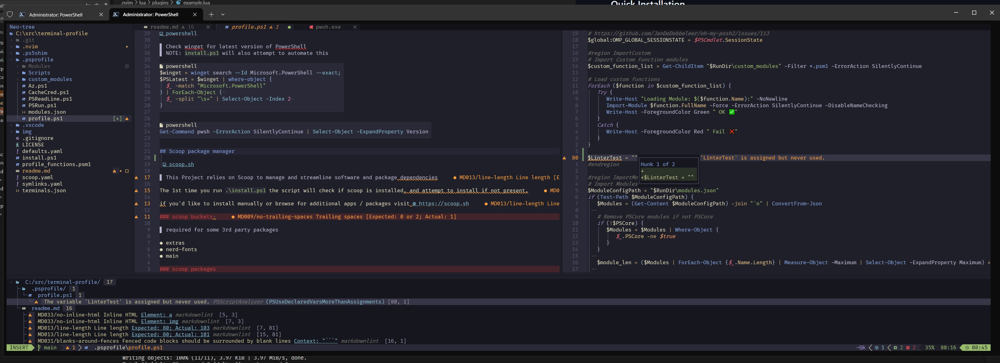

# Windots

## Quick Installation

  <a href="https://youtube.com/watch?v=2xkyf9uLK5M">

  
</a>

1. Go the the parent directory where you want the repo to exist (ex. `c:\src`)
2. Run the following command as **Administrator** in PowerShell

```PowerShell
# Clones Repo to directory and runs installer script
git clone https://github.com/Matalus/dotfiles.git terminal-profile; cd terminal-profile; .\install.ps1
```
 
## Install Script
>
> Script is idempotent, just run again to check for scoop updates etc (future update maybe incorporated into profile)

### Features

- config defaults `defaults.yaml`

```yaml
nerd_font: FiraCode Nerd Font Mono # This will be the primary Nerd Font used
fallback_font: CaskaydiaCove NF # This will be used as a fallback where applicable
posh_prompt: half-life # Run Get-PoshThemes to see all possible themes
default_terminal: pwsh # Name of default Windows Terminal Profile
home_dir: c:\src
```

- Symbolic links to keep all config in repo root (created by `install.ps1`)

```yaml
symlinks:
# Neovim
- name: neovim config
  source: .nvim
  target: $env:LOCALAPPDATA\nvim
  # PowerShell profiles
- name: Windows Powershell Shim Profile
  source: .ps5shim
  target: $PS5TempProfile
- name: PowerShell 7 Profile
  source: .psprofile
  target: $PS7TempProfile
  ```

- Shim Profile for Windows Powershell (5.1)
rather than maintaining 2 separate profiles, a shim profile will run when you launch **Windows Powershell** that will automatically run your **pwsh** (7.x) profile `.ps5shim/profile.ps1`.  Some features won't run for 5.1 based on the variable `$PSCore` that checks the version

```PowerShell
# Shim profile, points to Unified PSCore Profile
$DirContext = $pwd # Get Current Directory to revert to when complete

# Get PS7 Profile Path
$PSCoreProfile = & "pwsh.exe" -NoProfile -Command '$PROFILE.CurrentUserAllHosts'

Set-Location $(split-path -parent $PSCoreProfile)
& $PSCoreProfile # Run PSCore Profile

# Revert to former working directory after unified profile script runs
Set-Location $DirContext
```

- Windows Terminal Profile Patching
Will attempt to locate and patch the Windows Terminal `settings.json` to include preferred default terminal profiles as well as making sure they all have the same **Nerd Font** configured.

- Oh-My-Posh (default **half-life** theme) change in `defaults.yaml`
- PSReadline Customization (based on [SamplePSReadLineProfile.ps1](https://github.com/PowerShell/PSReadLine/blob/master/PSReadLine/SamplePSReadLineProfile.ps1))
- [Terminal-Icons](https://github.com/devblackops/Terminal-Icons)
- Automatic Update Checks

  > *updates available*

  

  > *up to date*

  

- `bat` (visual version of `cat` with syntax highlighting)

  

- `delta` (enhanced diff viewer, inline highlights)

  


## Neovim Setup (LazyVim)

neovim configuration will be stored in `.\.nvim` at the root of this repo.
A Symbolic Link is created with a target of `$env:LOCALAPPDATA\nvim` (`c:\users\<profile>\appdata\local\nvim`)
Neovim looks for it's configuration by default on windows in this directory.



### **Notable customizations**

- **COC.nvim (Conqueror of Completion)** configured to support `PowerShell` autocompletion
- **MarkdownLint** and **Markdown_Inline** configured in Mason to support live rendering in editor run `:RenderMarkdown`
- **colorschemes.lua** additional colorschemes
- **conform.nvim** setup for LSP and autoformatting `<leader>cf`
- **gitsigns.nvim** show inline diff `<leader>gp`
- **vim-fugitive**
- **undotree**


💤 LazyVim

<a href="https://youtube.com/watch?v=TC8Mc6Y5LTo">
  
</a>

## prerequisites

### Windows Terminal


> Installed via Scoop

### Install PowerShell 7


> Check winget for latest version of PowerShell (WIP)
> NOTE: `install.ps1` will also attempt to automate this, might replace the default builtin function

Method for getting latest version of powershell from winget

```powershell
$winget = winget search --Id Microsoft.PowerShell --exact;
$PSLatest = $winget | where-object {
  $_ -match "Microsoft.PowerShell"
} | ForEach-Object { 
  $_ -split "\s+" | Select-Object -Index 2 
}
```

```powershell
Get-Command pwsh -ErrorAction SilentlyContinue | Select-Object -ExpandProperty Version
```

This method might work better

```PowerShell
$UpdateCheck = [pscustomobject]@{
  Current=[version]($PSVersionTable.PSVersion | Select-Object Major,Minor,@{N="Build";E={$_.Patch}});
  Latest=[version](Invoke-RestMethod -Uri "https://aka.ms/pwsh-buildinfo-stable" | Select-Object -ExpandProperty  ReleaseTag | %{ $_ -replace "v"}) | Select-Object Major,Minor,Build
}
$NoUpdate = if (
   $UpdateCheck.Current.Major -eq $UpdateCheck.Latest.Major -and
   $UpdateCheck.Current.Minor -eq $UpdateCheck.Latest.Minor -and
   $UpdateCheck.Current.Build -eq $UpdateCheck.Latest.Build
) { $true }else { $false }
```

## Git Config

recommended git global configuration

```powershell
# edit git profile
git config --global -e
```

```git
[user]
  email = <email@domain.com>
  name = <Name>
  username = <UserName>
[credential]
  helper = C:/Users/<User>/AppData/Local/Programs/Git\\ Credential\\ Manager/git-credential-manager-core.exe
[init]
  defaultBranch = main
[mergetool "nvim"]
  cmd = nvim -f -c \"Gdiffsplit!\" \"$MERGED\"
[merge]
  tool = "nvimdiff -f"
[mergetool]
  prompt = false
[core]
  editor = "nvim -f"
  pager = "delta"
[safe]
  directory = *
[delta "interactive"]
  keep-plus-minus-markers = true
```

## Scoop package manager

 

> This Project relies on **Scoop** to manage and streamline software and package dependencies

The 1st time you run `.\install.ps1` the script will check if scoop is installed, and attempt to install if not present.

if you'd like to install manually or browse for additional apps / packages visit [https://scoop.sh](https://scoop.sh/)

### scoop buckets 

> required for some 3rd party packages

- extras
- nerd-fonts
- main

### scoop packages

> Add additional packages to `scoop.yaml` to make them required

- neovim
- extras/windows-terminal

- extras/terminal-icons
- extras/posh-git
- extras/psreadline
- extras/azuredatastudio
- extras/lazygit
- nerd-fonts/FiraCode-NF
- nerd-fonts/FiraCode-NF-Mono
- nerd-fonts/Cascadia-NF
- nerd-fonts/JetBrainsMono-NF
- main/oh-my-posh
- main/diffutils
- main/7zip
- main/lua
- main/curl
- main/nmap
- main/luarocks
- main/vim
- main/nano
- main/ast-grep
- main/cacert
- main/fd
- main/fzf
- main/grep
- main/gzip
- main/micro
- main/mingw
- main/ripgrep
- main/tree-sitter
- main/wget
- main/delta
- main/bat